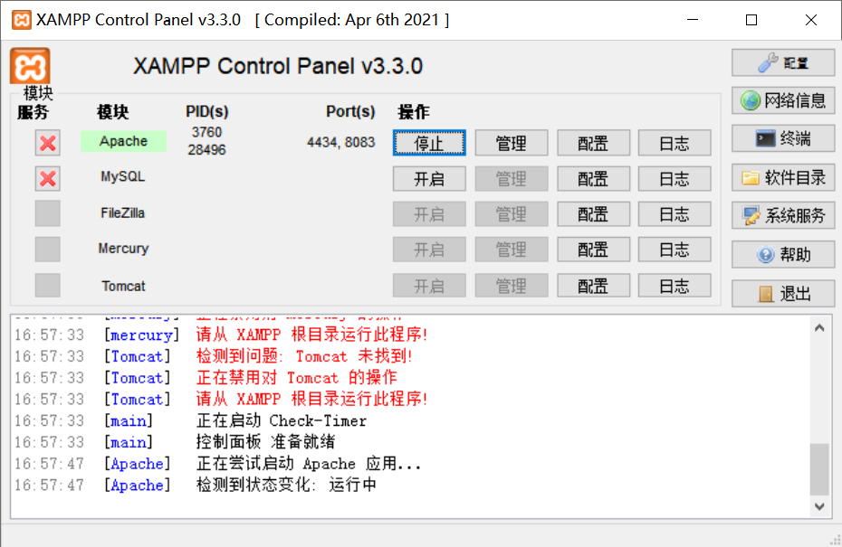

# XAMPP Control Panel for Windows Chinese 
XAMPP Control Panel ( for Windows ) 图形界面中文汉化, 仅提供中文语言补丁文件, 不包含本体软件

## 使用说明
Windows版客户端可用 [下载地址](https://www.apachefriends.org/download.html)

我修改的是德语文件, 你需要把软件的**语言切换为德语**才能显示中文

使用我提供的 **`locale`** 文件夹替换 XAMPP 根目录下的同名文件夹

如有需要, 请自行备份软件自带的德语文件 `xampp_control.po` 和 `xampp_control.mo` 

## 界面预览

## 无关话题
我发现如果软件的默认窗口大小被改变, 会导致启动时最小化功能失效, 与修改语言无关( XAMPP Control Panel v3.3.0 )

## 许可协议
[GPL-3.0 license](https://github.com/echopan/XAMPP_Control_Panel_Chinese?tab=GPL-3.0-1-ov-file)